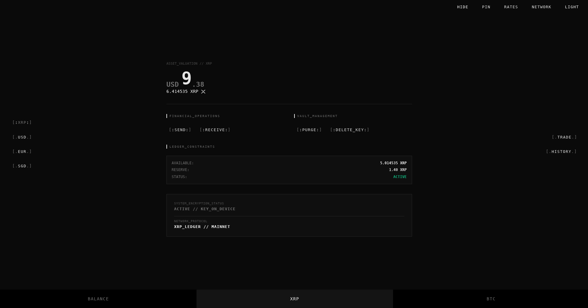

# Dannesk v0.3.1

Dannesk is a non-custodial DeFi wallet for **Bitcoin** and the **XRP Ledger**. Built in Rust for security and reliability, the app gives users complete control over their private keys, while enabling powerful trading capabilities on **XRPL’s native CLOB**. 

  

---

## Features

### Multi-Chain Wallet

Users may create a new wallet or import an existing one for:

- **Bitcoin**
- **XRP**

Additionally, users may enable trustlines and trade currencies for a fraction of a cent on the **XRPL native order book (CLOB)**.
Swaps are atomic, and occur **directly on-chain** with no centralized intermediary.

Supported assets include:

- **XRP**
- **RLUSD**
- **EUROP**
- **XSGD**
- **BTC**

---

### Security

Dannesk supports the optional BIP39 passphrase (sometimes called the 25th word). The 25th word allows for enhanced wallet security and the deterministic generation of multiple wallets from the same seed. 

Upon import/create, users are prompted to choose their own encryption passphrase and bip39 passphrase. The private keys are then encrypted locally on the user’s device using AES-256 encryption and Argon2id for key derivation. Users may choose to remove the key by clicking "delete key" on the dashboard, reverting to cold storage.

Transactions are **signed locally**. The signed transaction blob is then **broadcast to the network**. For added security, memory is also **zeroized** after signing operations. At no time does any sensitive data leave the user's device. 
  
---

### Beta 

The desktop app is already very capable with most of the basic features users will need. However, it's still lacking intermediate features such as "replace by fee" (Bitcoin), disabling
a trustline (XRP), and converting small balances (sometimes referred to as dust). 

The mobile app is not yet ready for production. 

We also hope to implement a few advanced features before v1.0.0 such as a federated bridge between XRP/BTC, allowing for decentralized swaps between the two chains. Fiat onboarding is also on the roadmap. 

We aim to release v1.0.0 for all platforms by the second quarter of 2027. 
  
---

## Installation

Download the latest release:

https://dannesk.com

Supported platforms:

- Linux (.deb) 
- Windows (.exe) 

---

## License

Dannesk is licensed under the **GNU General Public License v3 (GPLv3)**.